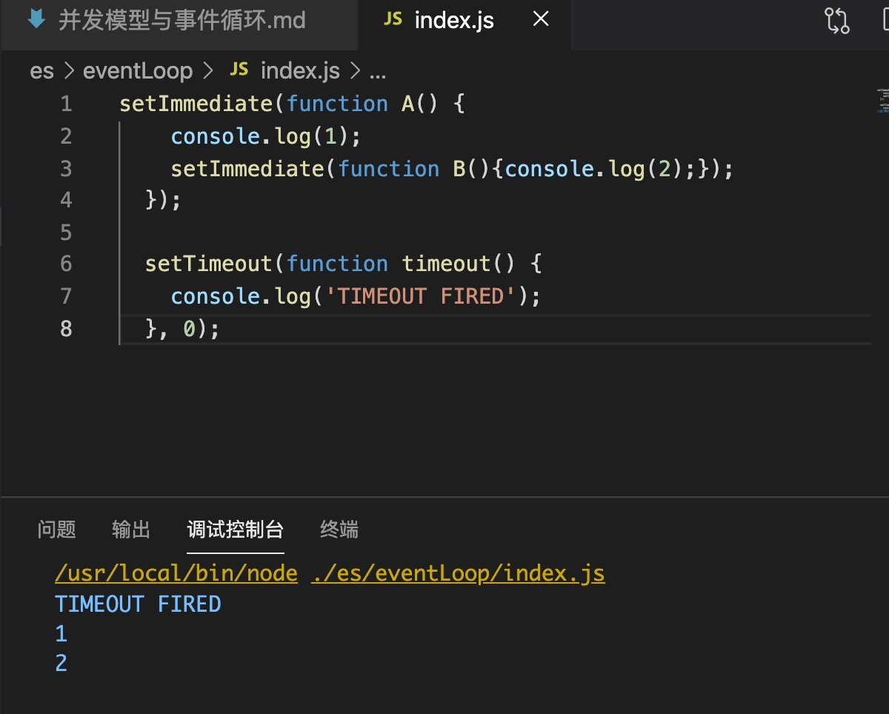

### 为什么JS是单线程
JS的单线程与最开始JS的用途有关，最开始JS是脚本语言，用来操作DOM；如果JS是多线程，则再操作DOM上会出现很高的复杂性（比如一个线程修改某一个DOM，另一个线程删除这个DOM），所以为了避免多线程引起的冲突等问题。再设计的时候就是只能单线程。

HTML5的web worker允许多线程，但是子线程必须受控于主线程，并且子线程不能操作DOM，所以基本没有改变单线程的本质。

### 一些概念
#### 任务队列

由于JS的单线程，所以任务就必须挨着排队进行处理。在主线程里面，前一个任务结束，执行后一个任务，如果前一个任务耗时很长，后一个任务就必须等着。

一般不是由于JS计算而等待，一般是由于I/O（比如键盘输入、网络请求）而等待，因此将任务分为同步任务、异步任务。

同步任务就是在主线程里以`执行栈`的方式进行。

异步任务需要耗时，JS会先不管异步任务，而是去执行排在后面的任务，当该异步任务返回结果来了之后，再进行执行。方式就是创建一个队列叫做`任务队列`，当异步任务结果出来以后，就发送一个`事件`放到队列后面。这就是`任务队列`，存的是异步任务有结果后触发的`event`。所以`任务队列`也是叫`事件队列`、`消息队列`

#### 执行栈

主线程里的是同步任务，表现形式上就是`执行栈`(函数运行时形成的栈)，栈中存放的是该函数调用其他函数形成的帧，执行栈上面一个任务（或者说是函数）执行完成，将结果传递给一个任务，然后结束，执行栈pop。

#### 堆
一大块内存区域，对象存放于堆中，比如执行栈中函数用到的一些变量等。

### 事件循环

执行栈、堆、任务队列之间处理消息（事件）的循环。
“执行至完成” -> 每一个消息都会完整的执行完成以后才会进行下一个消息的执行，缺点就是一旦有一个事件耗时比较久，就会出现卡顿、脚本执行过久的现象。

javascript运行时存放消息的队列，每一个消息都关联一个回调函数。如果一个消息没有回调函数，javascript事件循环不会将这个消息加入队列中。

javascript会从消息队列中取出最先进入队列的消息（注意是队列，先进先出，并且该消息已经出列了），并将这个消息作为参数调用与它相关连的回调函数。回调函数的处理就是执行栈的机制，会执行到栈为空为止然后处理下一个消息。

因为有`定时器`这类功能，主线程上的执行栈再执行的时候会检查执行时间。

“永不阻塞” -> 因为事件循环机制，通过事件-回调的方式来执行，会在事件发生的时候去执行回调，中途可以干其他的。[参考阻塞与非阻塞、异步与同步的概念](https://www.zhihu.com/question/19732473)

### 一些函数

#### setTimeout(fn, time) , setInterval(fn, time)

参数`time`代表的是主线程在最早能得到的时间，往后推迟time后执行。`setInterval`只是加了个循环。

#### process.nextTick() node

指的是在当前`执行栈`最后加一个回调，是在获取任务队列之前，执行栈执行完成同步任务的时候执行。因此这个函数总是发生在所有异步任务之前。
```javascript
    process.nextTick(() => {
        console.log(1)
        process.nextTick(()=>console.log(2))
    })
    console.log(3)
    setTimeout(()=>{
        console.log(4)
    }, 0)

    // 3 1 2 4
```

#### setImmediate node

和setTimeout类似，都是在当前队列尾部添加回调事件。但是：

可能会出现返回结果不确定的情况