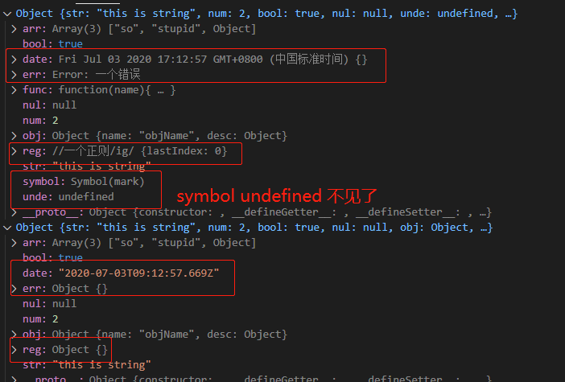
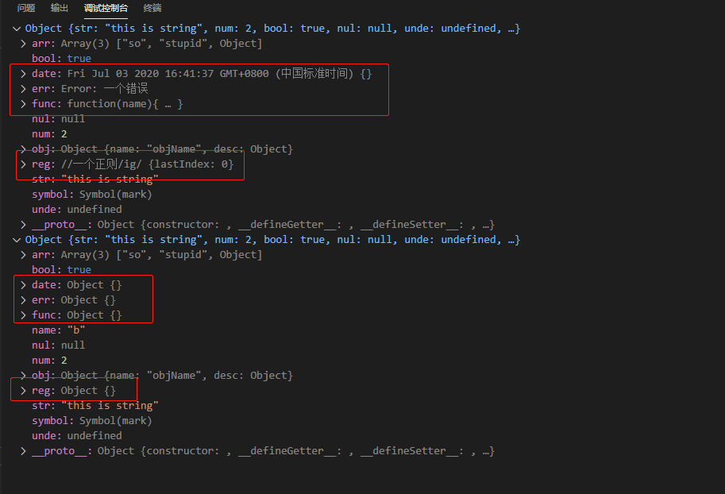

### 基本类型和引用类型

基本类型 -> 栈<br>
引用类型 -> 堆(栈中会存放一个指针，内容是一个内存地址，该地址是引用类型的地址)

基本类型比较 -> 值比较<br>
引用类型比较 -> 指针是否指向同一个对象

```
const a = [1, 2]
const b = a
b[1] = 3
console.log(a) // [1, 3]
```

### 浅拷贝 和 赋值

赋值：将一个变量指向了栈中的值，这个值可以是基本类型，也可以是引用对象的地址指针。
<br>
浅拷贝：只对原数据进行了“一次循环遍历赋值”，在这次循环赋值过程中，如果有key对应的value为引用类型，按照赋值的原理就是赋值的地址指针。

### 深拷贝

将一个引用对象从内存中进行拷贝，并且两个对象不存在有相同的栈指针指向同一个堆对象。(其实也不太对 -> Symbol这个值)

深拷贝 = 浅拷贝 + 递归

### 实现

1. 递归
2. 序列反序列化

### 问题

#### 序列化方法的问题
1. 特殊对象的失真 如(Date, Reg, Error, Function : 有特殊的构造函数)
2. symbol和undefined的丢失
3. 环 //JSON.stringify 做了环的检查，有环就会报错



#### 深拷贝（自我实现）（只注意普通对象和数组的情况）
1. 特殊对象的失真 如(Date, Reg, Error, Function)
2. 环(栈溢出)



#### lodash的cloneDeeep
1. 涵盖了大部分对象的复制，都能够复制成功。
2. 环的问题解决了（栈的使用）

### lodash cloneDeep源码

#### 位运算中的按位与、按位或

[位操作](https://developer.mozilla.org/zh-CN/docs/Web/JavaScript/Reference/Operators/Bitwise_Operators)
位运算解决权限拥有问题： linux 777 当前用户/当前用户组/其他用户 rwx
比如某个文件有读写没有执行权限 110 => 6 ，他的标志位（掩码）就是110

```
  // 判断是否有读权限
  110 & 100 => 100 // 转换boolean，true 有读权限
  // 判断是否有写权限
  110 & 010 => 010 // 有
  // 判断是否有执行权限
  110 & 001 => 000 // 转换boolean，false 没有执行权限
```
Tip: 一个权限的表示方法中，只有的掩码只会有1个1，其余的都是0。

#### Symbol

```
let s1 = Symbol('symbol')
let s2 = Symbol('symbol')
s1 === s2 // false 
```
#### 源码分析

### 区别和使用场景

1. 序列化对环做了报错处理，但是symbol和undefined丢失了
2. 自我实现只能应对一般的对象，很多特殊对象考虑不到

一般工作中的情况下序列化就够了


#### 参考资料

[深拷贝层级](https://yanhaijing.com/javascript/2018/10/10/clone-deep/)